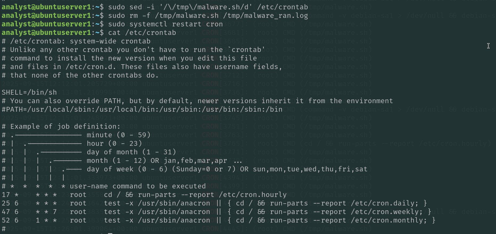

# Incident Response Lab Report

## **1. General Information**

This lab project demonstrates common attacker behaviours (brute-force, privilege escalation, and persistence) against Windows and Linux endpoints and shows how to detect and respond to them using native logs and common forensics/IR tools.

* **Environment:**
  * Windows 11 VM
  * Ubuntu Server VM
  * Kali VM
* **Tools Used:**
  * Sysinternals Suite (Process Explorer, Autoruns, TCPView, Sysmon)
  * Windows Event Viewer
  * Kali tools (Hydra, Nmap, etc.)

## **2. Attack Scenarios**

### **🔹 Windows Attack #1: Brute-force RDP Login**

<figure><figcaption></figcaption></figure>

* **Attack Simulation:**
  * From Kali Linux, perform an RDP brute-force attack using Hydra.
  * Example command:

hydra -l administrator -P rockyou.txt rdp://\<windows\_ip>

<figure><figcaption></figcaption></figure>

*   **Detection:**

    * **Event Viewer:** Security logs → Event ID 4625 (Failed logon attempts).
    * **Sysmon:** Repeated suspicious connections from a single IP address.

    <figure><figcaption></figcaption></figure>
* **Response:**
  * Block the attacker's IP address.

<figure><figcaption></figcaption></figure>

* Verify if any successful logins occurred.

PS C:\WINDOWS\system32> Get-WinEvent -FilterHashtable @{LogName='Security'; Id=4624} |

Where-Object { $_.Message -match $ip } | Select-Object TimeCreated, @{Name='Message';Expression={$_.Message\}} | Out-File C:\lab\_logs\4624\_from\_attacker.txt -Force

<figure><figcaption></figcaption></figure>

* **Mitigation:**
  * Configure account lockout policies.

<figure><figcaption></figcaption></figure>

* Restrict RDP access to VPN or specific IPs.

<figure><figcaption></figcaption></figure>

* Disable old general RDP rules.

<figure><figcaption></figcaption></figure>

### **🔹 Windows Attack #2: Privilege Escalation**

* **Attack Simulation:**
  * Create a local user and add it to the Administrators group

<figure><figcaption></figcaption></figure>

* **Detection:**
* **Event ID 4720** --- a user account was created (shows new\_user).
* **Event ID 4732** --- a member was added to the Administrators group (shows new\_user).

<figure><figcaption></figcaption></figure>

* **Event ID 4672** --- special privileges assigned to a logon (evidence of admin session).
* **Response:**
  * Disable the account: net user new\_user /active:no

<figure><figcaption></figcaption></figure>

* Kill suspicious processes / log off sessions: quser then logoff - ID

**Mitigation:**

* Apply security patches regularly.
* Implement least‑privilege (avoid daily admin accounts).

<figure><figcaption></figcaption></figure>

* Hardened account management (MFA for privileged accounts, restrict who can add admins).

### **🔹 Windows Attack #3: Malicious Persistence**

* **Attack Simulation:**
  * Add a fake executable to Windows Registry Run key or Task Scheduler for persistence.

<figure><figcaption></figcaption></figure>

*   **Detection:**

    * **Autoruns:** Displays a new suspicious startup item.

    <figure><figcaption></figcaption></figure>
* **Response:**
  * Remove malicious registry entry and executable.

<figure><figcaption></figcaption></figure>

* Perform a full endpoint scan for additional persistence mechanisms.
* **Mitigation:**
  * Regularly audit startup items with Autoruns.

<figure><figcaption></figcaption></figure>

<figure><figcaption></figcaption></figure>

<figure><figcaption></figcaption></figure>

* Use AppLocker or Windows Defender Application Control for whitelisting.

<figure><figcaption></figcaption></figure>

<figure><figcaption></figcaption></figure>

* Deploy EDR rules for persistence detection.

<figure><figcaption></figcaption></figure>

<figure><figcaption></figcaption></figure>

***

### **🔹 Linux Attack #1: Brute-force SSH Login**

<figure><figcaption></figcaption></figure>

* **Attack Simulation:**
  * From Kali Linux, brute-force SSH login to a Linux victim machine:

hydra -l root -P rockyou.txt ssh://\<linux\_ip>

\

<figure><figcaption></figcaption></figure>

<figure><figcaption></figcaption></figure>

*   **Detection:**

    * **/var/log/auth.log:** Access from a suspicious IP address.

    <figure><figcaption></figcaption></figure>
* **Response:**
  * Block attacker's IP via firewall:

sudo ufw deny from \<attacker\_ip>

<figure><figcaption></figcaption></figure>

<figure><figcaption></figcaption></figure>

<figure><figcaption></figcaption></figure>

* **Mitigation:**
  * Use SSH keys instead of passwords.
  * Restrict SSH access by IP or VPN.
  * Deploy Fail2ban or similar intrusion prevention tools.

<figure><figcaption></figcaption></figure>

<figure><figcaption></figcaption></figure>

<figure><figcaption></figcaption></figure>

### **🔹 Linux Attack #2: Privilege Escalation**

* **Attack Simulation:**
  * Local Privilege Escalation: a program was compiled, made root-owned with the SUID bit, and a NOPASSWD sudo entry was added, allowing a root shell to be obtained.

<figure><figcaption></figcaption></figure>

*   **Detection:**

    * **Auditd logs:** Commands executed with elevated privileges.

    grep 'COMMAND=' auth.log

    <figure><figcaption></figcaption></figure>

> The audit log shows that a file /tmp/suid-shell was created and compiled with root privileges, indicating preparation for local privilege escalation. The SUID bit was set on this file and a NOPASSWD sudoers entry was added for testuser, allowing commands to run as root without a password. Finally, auth.log confirms that testuser successfully executed a command as root, providing clear evidence of a successful local privilege escalation attack.

* **Response:**
  * Review and remediate altered configurations.
  * Remove SUID binaries and roll back sudoers.

<figure><figcaption></figcaption></figure>

* **Mitigation:**
  * Apply the principle of least privilege for sudo.
  * Audit and remove unnecessary SUID binaries.
  * Enforce SELinux/AppArmor profiles.

<figure><figcaption></figcaption></figure>

### **🔹 Linux Attack #3: Malicious Cronjob Persistence**

* **Attack Simulation:**
  * Add a malicious cronjob:

echo "\* \* \* \* \* /tmp/malware.sh" >> /etc/crontab

<figure><figcaption></figcaption></figure>

* **Detection:**
  * **Check crontab:**

crontab -l\
cat /etc/crontab

<figure><figcaption></figcaption></figure>

* **Response:**
  * Remove the malicious cronjob entry and the script.

<figure><figcaption></figcaption></figure>

* **Mitigation:**
  * Regularly audit crontabs and systemd timers.
  * Monitor for changes in /etc.
  * Limit write access to system cron files.

<figure><figcaption></figcaption></figure>

## **3. Conclusions**

* The simulations demonstrated how common attack vectors (brute-force, privilege escalation, persistence) can be executed and detected using native system logs and tools like Sysinternals.
* Early detection is possible through proactive log monitoring and process analysis.
* Long-term security relies on **patching, access control, and continuous monitoring**.

<figure><figcaption></figcaption></figure>

## **4. Appendices**

* Mapping to **MITRE ATT\&CK techniques**:
  * **Brute-force:** T1110
  * **Privilege Escalation:** T1068
  * **Persistence via Registry/Startup/Crontab:** T1547 / T1053
* Commands used in the lab:

## **Windows - Offensive / Attack**

| **Command**                                                                                                     | **Purpose**                                                           |
| --------------------------------------------------------------------------------------------------------------- | --------------------------------------------------------------------- |
| hydra -l administrator -P rockyou.txt rdp://\<windows\_ip>                                                      | RDP brute-force attack from Kali.                                     |
| reg add "HKLM\SOFTWARE\Microsoft\Windows\CurrentVersion\Run" /v MaliciousSvc /t REG\_SZ /d "C:\mal\mal.exe" /f  | Create a Registry Run key to achieve persistent on-boot execution.    |
| schtasks /create /sc onlogon /tn "MalSvc" /tr "C:\mal\mal.exe"                                                  | Create a scheduled task that runs at user logon (persistence).        |
| net user new\_user P@ssw0rd /add                                                                                | Create a local user account (example for escalation/persistence).     |
| net localgroup Administrators new\_user /add                                                                    | Add a local user to the Administrators group (privilege escalation).  |

## **Windows - Detection & Response**

| **Command / Action**                                                                                                                                                                                                                        | Purpose                                                                                         |
| ------------------------------------------------------------------------------------------------------------------------------------------------------------------------------------------------------------------------------------------- | ----------------------------------------------------------------------------------------------- |
| Get-WinEvent -FilterHashtable @{LogName='Security'; Id=4624} \| Where-Object { $\_.Message -match $ip } \| Select-Object TimeCreated, @{Name='Message';Expression={$\_.Message\}} \| Out-File C:\lab\_logs\4624\_from\_attacker.txt -Force  | Export successful logon events (ID 4624) filtered by attacker IP to a file for analysis.        |
| net user \<username> /active:no                                                                                                                                                                                                             | Disable a suspicious or compromised local account.                                              |
| quser                                                                                                                                                                                                                                       | List current interactive sessions on the host.                                                  |
| logoff \<ID>                                                                                                                                                                                                                                | Terminate a specific interactive session by session ID.                                         |
| (Autoruns GUI)                                                                                                                                                                                                                              | Enumerate Windows startup locations and entries to find persistence mechanisms.                 |
| (Process Explorer GUI)                                                                                                                                                                                                                      | Inspect running processes and their properties for suspicious activity.                         |
| (TCPView GUI)                                                                                                                                                                                                                               | View active TCP/UDP connections and associated processes.                                       |
| (Sysmon installation + Event Viewer)                                                                                                                                                                                                        | Enable and review detailed process/file/network telemetry for detection and forensic analysis.  |

## **Linux - Offensive / Attack**

| Command                                                     | Purpose                                                                        |
| ----------------------------------------------------------- | ------------------------------------------------------------------------------ |
| hydra -l root -P rockyou.txt ssh://\<linux\_ip>             | SSH brute-force attack from Kali.                                              |
| echo "\* \* \* \* \* /tmp/malware.sh" >> /etc/crontab       | Add a malicious system cron entry for frequent/persistent execution.           |
| gcc /tmp/suid.c -o /tmp/suid-shell                          | Compile an example SUID binary (used in privilege escalation demonstrations).  |
| chown root:root /tmp/suid-shell                             | Set owner to root for an SUID binary.                                          |
| chmod 4755 /tmp/suid-shell                                  | Set SUID bit to allow binary to run with owner (root) privileges.              |
| (visudo edit) testuser ALL=(ALL) NOPASSWD: /tmp/suid-shell  |  Add a NOPASSWD sudoers entry (example used to demonstrate sudo abuse).        |

## **Linux - Detection & Response**

| Command                                           | Purpose                                                                       |
| ------------------------------------------------- | ----------------------------------------------------------------------------- |
| sudo tail -n 200 /var/log/auth.log                | View recent authentication events and SSH attempts.                           |
| journalctl -u ssh                                 | View SSH service logs on systemd systems.                                     |
| crontab -l                                        | List the current user's crontab entries.                                      |
| cat /etc/crontab                                  | Inspect system crontab for unauthorized entries.                              |
| grep 'COMMAND=' /var/log/auth.log                 | Search authentication logs for executed commands (sudo/ssh command logging).  |
| ausearch -m USER\_CMD                             | Query auditd for recorded user command execution events.                      |
| sudo ufw deny from \<attacker\_ip>                | Block an attacker IP address using UFW firewall.                              |
| rm /tmp/suid-shell or chmod 0755 /tmp/suid-shell  | Remove or neutralize unauthorized SUID binaries as remediation.               |
| (visudo edit)                                     | Remove malicious sudoers entries via safe editor (visudo).                    |
